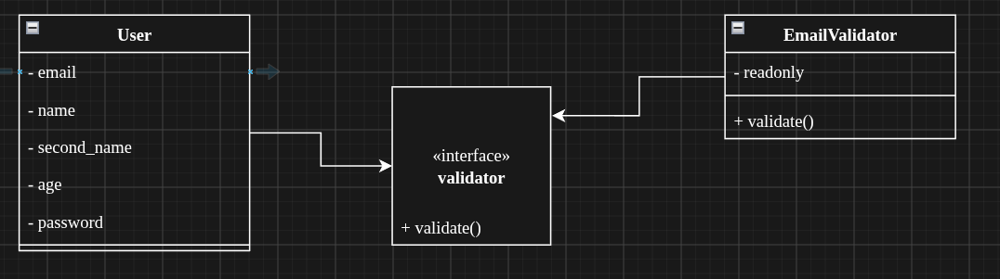

# Aug26So - Sistema de Registro & Notificaciones 🚀

[](https://react.dev/)
[](https://www.typescriptlang.org/)
[](https://vitejs.dev/)
[](https://expressjs.com/)
[](https://orm.drizzle.team/)

Aplicación Fullstack para registro y gestión de usuarios, con validación de contraseñas en tiempo real, persistencia en base de datos MySQL y envío de correos de confirmación / bienvenida con soporte para entornos de prueba y producción.

---

## 📐 Diagrama UML

Diseño y modelado de la arquitectura del sistema:

<p align="center">
  
</p>

---

## 🛠️ Stack Tecnológico

- **Frontend:** React 19, TypeScript, Vite, CSS nativo interactivo.
- **Backend:** Node.js, Express 5, TypeScript (vía `tsx`).
- **Base de datos & ORM:** MySQL 2 + Drizzle ORM.
- **Mailing:** Nodemailer (soporta SMTP y cuentas de test con Ethereal en local).

---

## ✨ Características

- 📝 **Formulario interactivo:** validación en vivo de campos, formato de correo y medidor visual de seguridad de contraseña.
- ✉️ **Servicio de correo:** envío de plantillas HTML de bienvenida con opción de reenvío y preview directo en desarrollo.
- 🗄️ **Base de datos:** esquema tipado y consultas seguras con Drizzle ORM sobre MySQL.
- ⚡ **Desarrollo rápido:** Hot Reload tanto en frontend (Vite) como en backend (`tsx watch`).

---

## 📁 Estructura del Repositorio

```text
├── docs/
│   └── uml/               # Diagramas y capturas UML (uml.png)
├── server/                # Backend API (Express + Drizzle)
│   ├── src/
│   │   ├── db/            # Conexión y esquema de BD (schema.ts)
│   │   ├── routes/        # Endpoints y validaciones
│   │   ├── services/      # Servicio de correo (Nodemailer)
│   │   └── index.ts       # Entrada del servidor
│   └── .env.example       # Plantilla de variables de entorno
├── src/                   # Frontend (React + Vite)
│   ├── App.tsx            # Componente principal y formulario
│   ├── App.css            # Estilos y animaciones
│   └── main.tsx
├── package.json
└── README.md
```

---

## 🚀 Inicio Rápido

### 1. Clonar e instalar dependencias

```bash
# Dependencias de frontend y raíz
npm install

# Dependencias del backend
npm --prefix server install
```

### 2. Variables de entorno

Copia la plantilla de entorno en la carpeta `server`:

```bash
cp server/.env.example server/.env
```

Configura tu conexión a MySQL en `server/.env` (si dejas las variables de correo vacías, usará Ethereal automáticamente para pruebas locales).

### 3. Ejecutar en modo desarrollo

Abre dos terminales o corre los scripts:

```bash
# Terminal 1 - Backend (http://localhost:3000)
npm run server

# Terminal 2 - Frontend (http://localhost:5173)
npm run dev
```

---

## 🔌 Endpoints de la API

| Método | Endpoint | Descripción |
| :--- | :--- | :--- |
| `GET` | `/api/users` | Lista todos los usuarios registrados |
| `GET` | `/api/users/:id` | Obtiene los datos de un usuario por su ID |
| `POST` | `/api/users` | Registra un usuario y envía el correo de bienvenida |
| `POST` | `/api/resend-email` | Reenvía el correo de confirmación a un usuario |
